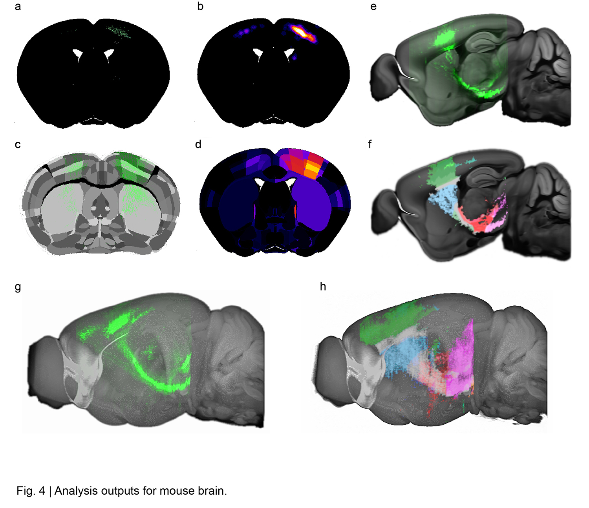
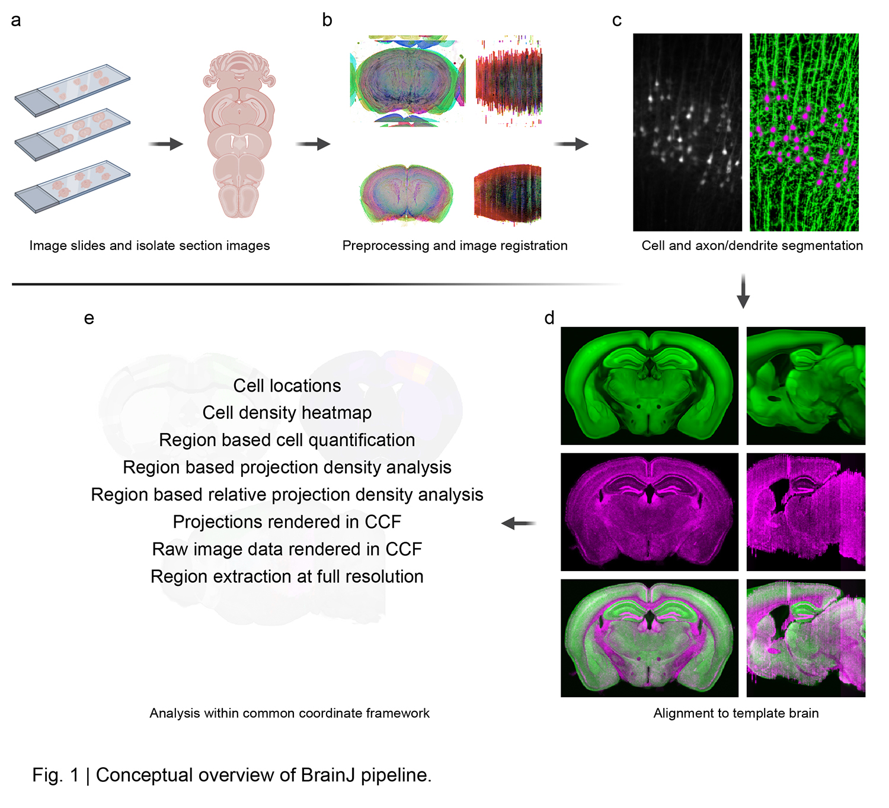

# BrainJ
An accessible tool for automated brain reconstruction, mesoscale mapping, and cell analysis.

Please read the [BrainJ Guide.pdf](https://github.com/lahammond/BrainJ/blob/master/BrainJ%20Guide%209_3.pdf) for step-by-step instructions and troubleshooting.

Now supporting the enhanced and unified mouse brain atlas - https://www.nature.com/articles/s41467-019-13057-w

If you are reconstructing and analyzing spinal cords - see our new tool [SpinalJ](https://github.com/felixfiederling/SpinalJ) for the mouse spinal cord.**

## About

Reconstructing serial tissue sections into whole brains and analyzing them within a common coordinate framework is an essential capability for the discovery of novel circuits and studies in neuroscience. Many existing solutions require coding experience, commercial software, or labor intensive interaction and annotation for researchers. With an emphasis on accessibility and automation, BrainJ enables high-throughput analysis of serial tissue sections imaged using confocal or widefield techniques. Developed in Fiji, our approach leverages freely available tools for machine learning pixel classification for cell detection and mesoscale mapping of axons and dendrites. With a simple graphical user interface, this approach is easy to deploy and use, requiring no coding experience and minimal manual intervention to process multiple datasets. Our approach is extensible to any project requiring serial section reconstruction and atlas-based analysis and allows a typical whole brain dataset to be reconstructed and analyzed within 2-4 hours.

## Installation

* Install [Fiji/ImageJ](http://fiji.sc/Fiji)
* Install BrainJ - Download BrainJ.jar and copy into your ImageJ plugins folder
* Install [MultiStackReg](http://bradbusse.net/sciencedownloads.html) - Download and copy into your ImageJ plugins folder
* Install [TurboReg](http://bigwww.epfl.ch/thevenaz/turboreg/) 
* Install [Elastix 5.0.0](http://elastix.isi.uu.nl/download_links.php)
* Install [Ilastix 1.3.3post3](https://www.ilastik.org/download.html)
* Download the required [atlas files](https://www.dropbox.com/sh/z6au8vtauiaw9vt/AACyG_jIXxZN7mLdjyHJRJuba?dl=0) and [Ilastik project](https://www.dropbox.com/sh/dbu2uue8x5gwkbi/AABqgoFY_-KuMkwwXDEVzpoNa?dl=0)
* Store the atlas files folder somewhere on your computer. The pipeline will use the files
in this folder to perform analysis and generate visualizations

## Usage

* __See the [BrainJ Guide.pdf](https://github.com/lahammond/BrainJ/blob/master/BrainJ%20Guide%209_3.pdf) for step-by-step instructions__

## Limitations

* Badly damaged tissue may prevent registration and alignment to atlas.

## Similar Tools

For tissue sections:
* [TissueMetrics](https://www.tissuemetrics.com/about)
* [NeuroInfo](https://www.mbfbioscience.com/blog/tag/neuroinfo/)
* [CellFinder](https://github.com/SainsburyWellcomeCentre/cellfinder)
* [HistoloZee](http://picsl.upenn.edu/software/histolozee/)
* [QuickNII](https://www.nitrc.org/projects/quicknii)
* [BrainMaker](https://www.mbfbioscience.com/brainmaker)
* [WholeBrain](http://www.wholebrainsoftware.org/)
* [BrainPatterns](http://brainpatterns.compute.dtu.dk/)

For whole brain data:
* [ClearMap](https://idisco.info/clearmap-2/)
* [Brainmapr](https://github.com/hms-dbmi/brainmapr)
* [SMART](https://mjin1812.github.io/SMART/)

